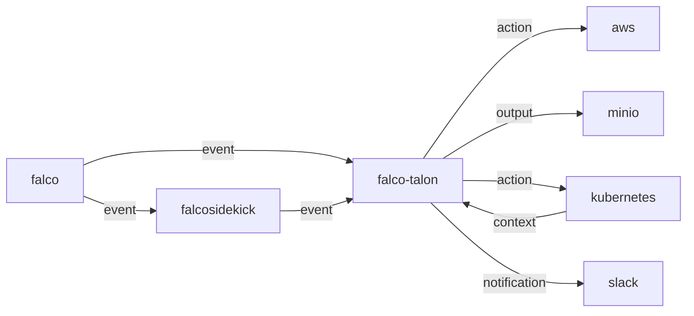

# Falco Talon

   

## Description

`Falco Talon` is a Response Engine for managing threats in your Kubernetes. It enhances the solutions proposed by the Falco community with a no-code tailor made solution. With easy rules, you can react to `events` from [`Falco`](https://falco.org) in milliseconds.

## Architecture

`Falco Talon` can receive the `events` from [`Falco`](https://falco.org) or [`Falcosidekick`](https://github.com/falcosecurity/falcosidekick):



## Documentation

The full documentation is available on its own website: [https://docs.falco-talon.org/docs](https://docs.falco-talon.org/docs).

## Installation

```shell
helm repo add falcosecurity https://falcosecurity.github.io/charts 
helm repo update
helm install falco-talon falcosecurity/falco-talon -n falco --create-namespace -f values.yaml
```

### Update the rules

Update `rules.yaml` then:

```
helm upgrade falco-talon falcosecurity/falco-talon -n falco -f values.yaml
```

### Uninstall Falco Talon

```
helm delete falco-talon -n falco
````

## Configuration

## Values

| Key | Type | Default | Description |
|-----|------|---------|-------------|
| affinity | object | `{}` | affinity |
| config | object | `{"aws":{"accesKey":"","externalId":"","region":"","roleArn":"","secretKey":""},"deduplication":{"leaderElection":true,"timeWindowSeconds":5},"defaultNotifiers":["k8sevents"],"listenAddress":"0.0.0.0","listenPort":2803,"minio":{"accessKey":"","endpoint":"","secretKey":"","useSsl":false},"notifiers":{"elasticsearch":{"createIndexTemplate":true,"numberOfReplicas":1,"numberOfShards":1,"url":""},"loki":{"apiKey":"","customHeaders":[],"hostPort":"","tenant":"","user":""},"slack":{"footer":"https://github.com/falcosecurity/falco-talon","format":"long","icon":"https://upload.wikimedia.org/wikipedia/commons/2/26/Circaetus_gallicus_claw.jpg","username":"Falco Talon","webhookUrl":""},"smtp":{"format":"html","from":"","hostPort":"","password":"","tls":false,"to":"","user":""},"webhook":{"url":""}},"otel":{"collectorEndpoint":"","collectorPort":4317,"collectorUseInsecureGrpc":false,"metricsEnabled":false,"tracesEnabled":false},"printAllEvents":false,"rulesOverride":"- action: Terminate Pod\n  actionner: kubernetes:terminate\n  parameters:\n    ignore_daemonsets: true\n    ignore_statefulsets: true\n    grace_period_seconds: 20\n","watchRules":true}` | config of Falco Talon (See https://docs.falco-talon.org/docs/configuration/) |
| config.aws | object | `{"accesKey":"","externalId":"","region":"","roleArn":"","secretKey":""}` | aws |
| config.aws.accesKey | string | `""` | access key (if not specified, default access_key from provider credential chain will be used) |
| config.aws.externalId | string | `""` | external id |
| config.aws.region | string | `""` | region (if not specified, default region from provider credential chain will be used) |
| config.aws.roleArn | string | `""` | role arn |
| config.aws.secretKey | string | `""` | secret key (if not specified, default secret_key from provider credential chain will be used) |
| config.deduplication | object | `{"leaderElection":true,"timeWindowSeconds":5}` | deduplication of the Falco events |
| config.deduplication.leaderElection | bool | `true` | enable the leader election for cluster mode |
| config.deduplication.timeWindowSeconds | int | `5` | duration in seconds for the deduplication time window |
| config.defaultNotifiers | list | `["k8sevents"]` | default notifiers for all rules |
| config.listenAddress | string | `"0.0.0.0"` | listen address |
| config.listenPort | int | `2803` | listen port |
| config.minio | object | `{"accessKey":"","endpoint":"","secretKey":"","useSsl":false}` | minio |
| config.minio.accessKey | string | `""` | access key |
| config.minio.endpoint | string | `""` | endpoint |
| config.minio.secretKey | string | `""` | secret key |
| config.minio.useSsl | bool | `false` | use ssl |
| config.notifiers | object | `{"elasticsearch":{"createIndexTemplate":true,"numberOfReplicas":1,"numberOfShards":1,"url":""},"loki":{"apiKey":"","customHeaders":[],"hostPort":"","tenant":"","user":""},"slack":{"footer":"https://github.com/falcosecurity/falco-talon","format":"long","icon":"https://upload.wikimedia.org/wikipedia/commons/2/26/Circaetus_gallicus_claw.jpg","username":"Falco Talon","webhookUrl":""},"smtp":{"format":"html","from":"","hostPort":"","password":"","tls":false,"to":"","user":""},"webhook":{"url":""}}` | notifiers (See https://docs.falco-talon.org/docs/notifiers/list/ for the settings) |
| config.notifiers.elasticsearch | object | `{"createIndexTemplate":true,"numberOfReplicas":1,"numberOfShards":1,"url":""}` | elasticsearch |
| config.notifiers.elasticsearch.createIndexTemplate | bool | `true` | create the index template |
| config.notifiers.elasticsearch.numberOfReplicas | int | `1` | number of replicas |
| config.notifiers.elasticsearch.numberOfShards | int | `1` | number of shards |
| config.notifiers.elasticsearch.url | string | `""` | url |
| config.notifiers.loki | object | `{"apiKey":"","customHeaders":[],"hostPort":"","tenant":"","user":""}` | loki |
| config.notifiers.loki.apiKey | string | `""` | api key |
| config.notifiers.loki.customHeaders | list | `[]` | custom headers |
| config.notifiers.loki.hostPort | string | `""` | host:port |
| config.notifiers.loki.tenant | string | `""` | tenant |
| config.notifiers.loki.user | string | `""` | user |
| config.notifiers.slack | object | `{"footer":"https://github.com/falcosecurity/falco-talon","format":"long","icon":"https://upload.wikimedia.org/wikipedia/commons/2/26/Circaetus_gallicus_claw.jpg","username":"Falco Talon","webhookUrl":""}` | slack |
| config.notifiers.slack.footer | string | `"https://github.com/falcosecurity/falco-talon"` | footer |
| config.notifiers.slack.format | string | `"long"` | format |
| config.notifiers.slack.icon | string | `"https://upload.wikimedia.org/wikipedia/commons/2/26/Circaetus_gallicus_claw.jpg"` | icon |
| config.notifiers.slack.username | string | `"Falco Talon"` | username |
| config.notifiers.slack.webhookUrl | string | `""` | webhook url |
| config.notifiers.smtp | object | `{"format":"html","from":"","hostPort":"","password":"","tls":false,"to":"","user":""}` | smtp |
| config.notifiers.smtp.format | string | `"html"` | format |
| config.notifiers.smtp.from | string | `""` | from |
| config.notifiers.smtp.hostPort | string | `""` | host:port |
| config.notifiers.smtp.password | string | `""` | password |
| config.notifiers.smtp.tls | bool | `false` | enable tls |
| config.notifiers.smtp.to | string | `""` | to |
| config.notifiers.smtp.user | string | `""` | user |
| config.notifiers.webhook | object | `{"url":""}` | webhook |
| config.notifiers.webhook.url | string | `""` | url |
| config.otel | object | `{"collectorEndpoint":"","collectorPort":4317,"collectorUseInsecureGrpc":false,"metricsEnabled":false,"tracesEnabled":false}` | open telemetry parameters |
| config.otel.collectorEndpoint | string | `""` | collector endpoint |
| config.otel.collectorPort | int | `4317` | collector port |
| config.otel.collectorUseInsecureGrpc | bool | `false` | use insecure grpc |
| config.otel.metricsEnabled | bool | `false` | enable otel metrics |
| config.otel.tracesEnabled | bool | `false` | enable otel traces |
| config.printAllEvents | bool | `false` | print in stdout all received events, not only those which match a rule |
| config.watchRules | bool | `true` | auto reload the rules when the files change |
| extraEnv | list | `[{"name":"LOG_LEVEL","value":"warning"}]` | extra env |
| grafana | object | `{"dashboards":{"configMaps":{"talon":{"folder":"","name":"falco-talon-grafana-dashboard","namespace":""}},"enabled":false}}` | grafana contains the configuration related to grafana. |
| grafana.dashboards | object | `{"configMaps":{"talon":{"folder":"","name":"falco-talon-grafana-dashboard","namespace":""}},"enabled":false}` | dashboards contains configuration for grafana dashboards. |
| grafana.dashboards.configMaps | object | `{"talon":{"folder":"","name":"falco-talon-grafana-dashboard","namespace":""}}` | configmaps to be deployed that contain a grafana dashboard. |
| grafana.dashboards.configMaps.talon | object | `{"folder":"","name":"falco-talon-grafana-dashboard","namespace":""}` | falco-talon contains the configuration for falco talon's dashboard. |
| grafana.dashboards.configMaps.talon.folder | string | `""` | folder where the dashboard is stored by grafana. |
| grafana.dashboards.configMaps.talon.name | string | `"falco-talon-grafana-dashboard"` | name specifies the name for the configmap. |
| grafana.dashboards.configMaps.talon.namespace | string | `""` | namespace specifies the namespace for the configmap. |
| grafana.dashboards.enabled | bool | `false` | enabled specifies whether the dashboards should be deployed. |
| image | object | `{"pullPolicy":"Always","registry":"falco.docker.scarf.sh","repository":"falcosecurity/falco-talon","tag":""}` | image parameters |
| image.pullPolicy | string | `"Always"` | The image pull policy |
| image.registry | string | `"falco.docker.scarf.sh"` | The image registry to pull from |
| image.repository | string | `"falcosecurity/falco-talon"` | The image repository to pull from |
| image.tag | string | `""` | Override the image tag to pull |
| imagePullSecrets | list | `[]` | one or more secrets to be used when pulling images |
| ingress | object | `{"annotations":{},"enabled":false,"hosts":[{"host":"falco-talon.local","paths":[{"path":"/"}]}],"tls":[]}` | ingress parameters |
| ingress.annotations | object | `{}` | annotations of the ingress |
| ingress.enabled | bool | `false` | enable the ingress |
| ingress.hosts | list | `[{"host":"falco-talon.local","paths":[{"path":"/"}]}]` | hosts |
| ingress.tls | list | `[]` | tls |
| nameOverride | string | `""` | override name |
| nodeSelector | object | `{}` | node selector |
| podAnnotations | object | `{}` | pod annotations |
| podSecurityContext | object | `{"fsGroup":1234,"runAsUser":1234}` | pod security context |
| podSecurityContext.fsGroup | int | `1234` | group |
| podSecurityContext.runAsUser | int | `1234` | user id |
| podSecurityPolicy | object | `{"create":false}` | pod security policy |
| podSecurityPolicy.create | bool | `false` | enable the creation of the PSP |
| priorityClassName | string | `""` | priority class name |
| rbac | object | `{"caliconetworkpolicies":["get","update","patch","create"],"ciliumnetworkpolicies":["get","update","patch","create"],"clusterroles":["get","delete"],"configmaps":["get","delete"],"daemonsets":["get","delete"],"deployments":["get","delete"],"events":["get","update","patch","create"],"leases":["get","update","patch","watch","create"],"namespaces":["get","delete"],"networkpolicies":["get","update","patch","create"],"nodes":["get","update","patch","watch","create"],"pods":["get","update","patch","delete","list"],"podsEphemeralcontainers":["patch","create"],"podsEviction":["get","create"],"podsExec":["get","create"],"podsLog":["get"],"replicasets":["get","delete"],"roles":["get","delete"],"secrets":["get","delete"],"serviceAccount":{"create":true,"name":""},"statefulsets":["get","delete"]}` | rbac |
| rbac.serviceAccount.create | bool | `true` | create the service account. If create is false, name is required |
| rbac.serviceAccount.name | string | `""` | name of the service account |
| replicaCount | int | `2` | number of running pods |
| resources | object | `{}` | resources |
| service | object | `{"annotations":{},"port":2803,"type":"ClusterIP"}` | service parameters |
| service.annotations | object | `{}` | annotations of the service |
| service.port | int | `2803` | port of the service |
| service.type | string | `"ClusterIP"` | type of service |
| serviceMonitor | object | `{"additionalLabels":{},"enabled":false,"interval":"30s","path":"/metrics","port":"http","relabelings":[],"scheme":"http","scrapeTimeout":"10s","targetLabels":[],"tlsConfig":{}}` | serviceMonitor holds the configuration for the ServiceMonitor CRD. |
| serviceMonitor.additionalLabels | object | `{}` | additionalLabels specifies labels to be added on the Service Monitor. |
| serviceMonitor.enabled | bool | `false` | enable the deployment of a Service Monitor for the Prometheus Operator. |
| serviceMonitor.interval | string | `"30s"` | interval specifies the time interval at which Prometheus should scrape metrics from the service. |
| serviceMonitor.path | string | `"/metrics"` | path at which the metrics are exposed |
| serviceMonitor.port | string | `"http"` | portname at which the metrics are exposed |
| serviceMonitor.relabelings | list | `[]` | relabelings configures the relabeling rules to apply the target’s metadata labels. |
| serviceMonitor.scheme | string | `"http"` | scheme specifies network protocol used by the metrics endpoint. In this case HTTP. |
| serviceMonitor.scrapeTimeout | string | `"10s"` | scrapeTimeout determines the maximum time Prometheus should wait for a target to respond to a scrape request. If the target does not respond within the specified timeout, Prometheus considers the scrape as failed for that target. |
| serviceMonitor.targetLabels | list | `[]` | targetLabels defines the labels which are transferred from the associated Kubernetes service object onto the ingested metrics. |
| serviceMonitor.tlsConfig | object | `{}` | tlsConfig specifies TLS (Transport Layer Security) configuration for secure communication when scraping metrics from a service. It allows you to define the details of the TLS connection, such as CA certificate, client certificate, and client key. Currently, the k8s-metacollector does not support TLS configuration for the metrics endpoint. |
| tolerations | list | `[]` | tolerations |

## Connect Falcosidekick

Once you have installed `Falco Talon` with Helm, you need to connect `Falcosidekick` by adding the flag `--set falcosidekick.config.webhook.address=http://falco-talon:2803`

```shell
helm upgrade -i falco falcosecurity/falco --namespace falco \
  --create-namespace \
  --set tty=true \
  --set falcosidekick.enabled=true \
  --set falcosidekick.config.talon.address=http://falco-talon:2803
```

## License

Falco Talon is licensed to you under the **Apache 2.0** open source license.

## Author

Thomas Labarussias (https://github.com/Issif)